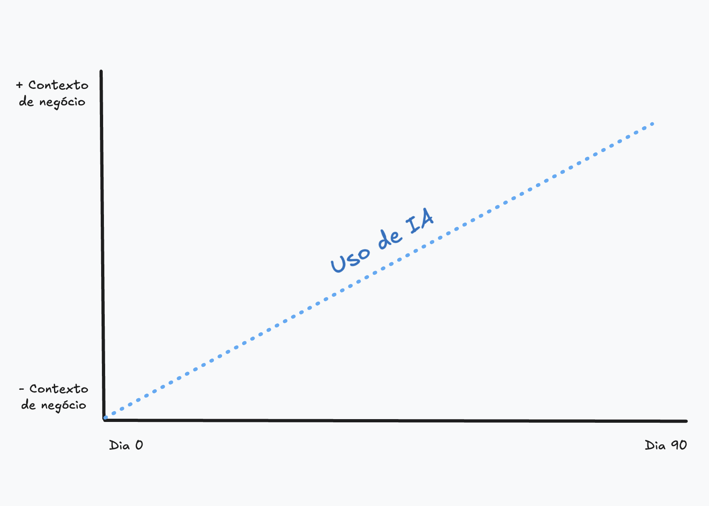

<p align="center">
  
</p>

<p align="center">
  <strong>AI-powered agents, memory architecture, and spec-driven workflows to elevate your engineering team's delivery.</strong>
</p>

<p align="center">
  <a href="#quick-start">Quick Start</a> •
  <a href="#development-flow">Flow</a> •
  <a href="#agents">Agents</a> •
  <a href="#ai-agent-memory-architecture">Memory</a> •
  <a href="#openspec-integration">OpenSpec</a> •
  <a href="#knowledge-base">Knowledge</a> •
  <a href="resources/">Resources</a>
</p>

<p align="center">
  <a href="https://github.com/space-metrics-ai/engineering-delivery-playbook/releases"></a>
  <a href="https://www.npmjs.com/package/eng-delivery-playbook"></a>
  
  
  
  
  
</p>

---

## What Is This?

The **Engineering Delivery Playbook** is a turnkey framework that gives your AI coding agents (Claude Code, Cursor, Copilot, Windsurf, etc.) everything they need to deliver production-grade code:

- **10 specialized agents** — Backend, Frontend, Mobile, DevOps engineers + reviewers + consultant
- **13 knowledge bases** — Design patterns, testing strategies, system design, and more
- **5-type cognitive memory** — Persistent context that survives across sessions
- **OpenSpec integration** — Spec-driven development so AI builds the *right* thing
- **1 command to start** — `npx eng-delivery-playbook`

> **AI is a force multiplier, not a replacement for understanding.** The playbook scales AI usage with your business context — from learning assistant (Day 0-30) to force multiplier (Day 90+).

---

## Quick Start

### 1. Install

```bash
npx eng-delivery-playbook
```

<details>
<summary>Alternative installation methods</summary>

**GitHub Packages:**
```bash
npm config set @space-metrics-ai:registry https://npm.pkg.github.com
npx @space-metrics-ai/eng-delivery-playbook
```

**curl:**
```bash
curl -fsSL https://raw.githubusercontent.com/space-metrics-ai/engineering-delivery-playbook/main/install.sh | bash
```
</details>

The installer will:
1. Copy all agents and knowledge bases to `./agents/`
2. Initialize `.AGENT/` memory architecture
3. Ask which agent you want to use
4. Auto-configure `CLAUDE.md` and `.cursorrules`

### 2. Install OpenSpec

```bash
npm install -g @fission-ai/openspec@latest
openspec init
```

### 3. Start building

```bash
# Switch to your agent
edp switch backend

# Propose a feature with OpenSpec
/opsx:propose "Add avatar upload: max 5MB, JPEG/PNG, resize 200x200, S3 storage"

# Or use the EDP automated flow
edp openspec start "Add avatar upload" be
```

That's it. Now follow the [Development Flow](#development-flow) below.

---

## Development Flow

<p align="center">
  
</p>

### The Philosophy

```
Traditional:  Vague idea → Start coding → Discover issues → Rewrite → Tech debt
Spec-driven:  Clear spec → AI understands context → Correct implementation → Ship fast
```

AI without context generates code that "works" but creates debt. **Specs give AI the full picture before it writes a single line.**

### The Flow

```
PROPOSE ──▶ DESIGN ──▶ TASKS ──▶ IMPLEMENT ──▶ REVIEW ──▶ SHIP
   │           │          │          │             │          │
   ▼           ▼          ▼          ▼             ▼          ▼
 OpenSpec   Technical   Break     Build with    Reviewer   Merge
 proposal   approach    down      agent         agent      & deploy
```

### 1. Propose (OpenSpec)

Use OpenSpec to create a spec-driven proposal before writing any code:

```bash
/opsx:propose "Add remember me checkbox with 30-day sessions"
```

This generates:
- `proposal.md` — Strategic rationale and scope
- `specs/` — Requirements with SHALL assertions and GIVEN/WHEN/THEN scenarios
- `design.md` — Technical approach and architecture decisions
- `tasks.md` — Implementation checklist

### 2. Implement

Switch to the right agent and apply the plan:

```bash
edp switch backend
/opsx:apply
```

Or use the EDP automated flow:

```bash
edp openspec start "Add avatar upload: max 5MB, JPEG/PNG" be
```

**Agent shortcuts:** `be` (backend), `fe` (frontend), `mob` (mobile), `ops` (devops)

### 3. Review

Switch to the reviewer agent:

```bash
edp switch be-review
```

Then:
```
"Review my implementation for security, error handling, and test coverage"
```

**Review format:** `blocker:` | `issue:` | `suggestion:` | `nit:`

### 4. Ship

```bash
/opsx:archive    # Archive the completed change
git add . && git commit -m "feat(users): add avatar upload"
gh pr create
```

---

## Agents

### Engineers

| Agent | Technologies | Alias | Link |
|-------|-------------|-------|------|
| **Backend** | Java, Go, Node.js, TypeScript, Kotlin, Python | `be` | [View](agents/backend.md) |
| **Frontend** | React, Vue.js, TypeScript, Next.js, Nuxt | `fe` | [View](agents/frontend.md) |
| **Mobile** | Flutter, Android (Kotlin), iOS (Swift) | `mob` | [View](agents/mobile.md) |
| **DevOps** | Kubernetes, Terraform, Docker, AWS/GCP/Azure | `ops` | [View](agents/devops.md) |

### Reviewers

| Agent | Focus | Alias | Link |
|-------|-------|-------|------|
| **Backend** | Security, performance, patterns | `be-review` | [View](agents/backend-reviewer.md) |
| **Frontend** | Accessibility, Core Web Vitals | `fe-review` | [View](agents/frontend-reviewer.md) |
| **Mobile** | Platform guidelines, performance | `mob-review` | [View](agents/mobile-reviewer.md) |
| **DevOps** | Security, reliability, IaC | `ops-review` | [View](agents/devops-reviewer.md) |

### Specialists

| Agent | Purpose | Alias | Link |
|-------|---------|-------|------|
| **Tech Consultant** | Architecture advice (no code) | `consult` | [View](agents/consultant.md) |
| **AI Metrics** | Track AI usage and ROI | — | [View](agents/ai-metrics.md) |

<details>
<summary>Switching agents</summary>

```bash
edp switch backend          # Full name
edp switch be               # Short alias
edp list                    # Show all available agents
```

Switching updates both `CLAUDE.md` and `.cursorrules` automatically.
</details>

---

## AI Agent Memory Architecture

The `.AGENT/` directory implements a **5-type cognitive memory system** inspired by how the human brain organizes knowledge — giving AI agents persistent context across sessions.

```
┌─────────────────────────────────────────────────────────────────────────┐
│                    AI AGENT MEMORY ARCHITECTURE                        │
├─────────────────────────────────────────────────────────────────────────┤
│                                                                         │
│  .AGENT/                                                                │
│  │                                                                      │
│  ├── working_memory/              "What am I doing now?"                │
│  │   ├── context.json               Current conversation and goals      │
│  │   └── stack.json                  Current task stack                  │
│  │                                                                      │
│  ├── procedural_memory/           "How do I do this?"                   │
│  │   ├── AGENTS.md                   Agent rules and behavior           │
│  │   └── skills/                     Reusable workflows                 │
│  │       ├── code_review.md            PR review steps                  │
│  │       └── deploy_pipeline.md        Deployment checklist             │
│  │                                                                      │
│  ├── semantic_memory/             "What do I know?"                     │
│  │   ├── project/                    Project information                │
│  │   │   ├── architecture.md           System design                    │
│  │   │   └── conventions.md            Coding standards                 │
│  │   └── entities/                   Key actors and services            │
│  │       ├── people.json               Team members                     │
│  │       └── services.json             Internal services                │
│  │                                                                      │
│  ├── episodic_memory/             "What happened before?"               │
│  │   ├── conversations/              Conversation logs                  │
│  │   │   └── 2025-03-14_debug_session.json                             │
│  │   └── decisions/                  Important decisions                │
│  │       └── 2025-03-15_switch_vitest.md                               │
│  │                                                                      │
│  └── meta_memory/                 "How can I improve memory?"           │
│      ├── memory_config.json          Memory configuration               │
│      └── reflections.jsonl           Learning reflections               │
│                                                                         │
└─────────────────────────────────────────────────────────────────────────┘
```

### Memory Types

| Type | Question | Purpose | Persistence | Color |
|------|----------|---------|-------------|-------|
| **Working** | What am I doing now? | Active session context — current goals, files, changes | Session | Blue |
| **Procedural** | How do I do this? | How-to knowledge — agent rules, reusable skill workflows | Permanent | Green |
| **Semantic** | What do I know? | Stored knowledge — architecture, conventions, team, services | Permanent | Red |
| **Episodic** | What happened before? | Past activity — conversation logs, important decisions | Rolling | Yellow |
| **Meta** | How can I improve? | Memory management — config, reflections, limits | Permanent | Purple |

### How It Works

```
┌──────────┐     ┌──────────────┐     ┌──────────────┐
│  Agent   │────▶│   Working    │────▶│   Episodic   │
│  starts  │     │   Memory     │     │   Memory     │
│  session │     │  (active)    │     │  (saved)     │
└──────────┘     └──────┬───────┘     └──────────────┘
                        │
                 ┌──────▼───────┐
                 │  Procedural  │ ◀── Skills & rules
                 │  + Semantic  │ ◀── Project knowledge
                 │   Memory     │
                 └──────┬───────┘
                        │
                 ┌──────▼───────┐
                 │    Meta      │ ◀── Self-improvement
                 │   Memory     │
                 └──────────────┘
```

1. **Session starts** → Agent loads working memory (current context)
2. **Agent works** → Reads procedural memory (how-to) + semantic memory (project knowledge)
3. **Session ends** → Key interactions saved to episodic memory (conversations, decisions)
4. **Over time** → Meta memory tracks what works and optimizes recall

### Setup

```bash
edp memory init          # Initialize .AGENT/ in your project
edp memory status        # Check memory status
edp memory init --force  # Reset to defaults
```

### Customization

Edit the files inside `.AGENT/` to match your project:

| File | What to customize |
|------|-------------------|
| `semantic_memory/project/architecture.md` | Your system design, tech stack, data flow |
| `semantic_memory/project/conventions.md` | Your coding standards, naming, git conventions |
| `semantic_memory/entities/people.json` | Your team members, roles, focus areas |
| `semantic_memory/entities/services.json` | Your services, APIs, external dependencies |
| `procedural_memory/skills/*.md` | Add custom skills (workflows your agent should know) |

Episodic memory (`conversations/` and `decisions/`) is populated automatically as the agent works.

---

## OpenSpec Integration

[OpenSpec](https://openspec.dev/) is a lightweight spec-driven framework that acts as a **universal planning layer** for AI coding agents. It integrates natively with 30+ tools including Claude Code, Cursor, and Copilot.

### Why OpenSpec?

| Without specs | With OpenSpec |
|--------------|---------------|
| AI guesses requirements | AI reads structured specs |
| Context lost between sessions | Specs persist in your repo |
| Review code diffs only | Review **intent** via spec deltas |
| Plans exist in chat only | Plans live alongside code |

### Installation

```bash
npm install -g @fission-ai/openspec@latest
cd your-project
openspec init
```

### Core Commands

| Command | Description |
|---------|-------------|
| `/opsx:propose <feature>` | Create a new feature proposal with specs, design, and tasks |
| `/opsx:apply` | Execute implementation tasks from the proposal |
| `/opsx:verify` | Validate implementation against specs |
| `/opsx:archive` | Archive completed changes |
| `/opsx:continue` | Resume in-progress work |
| `/opsx:sync` | Synchronize specifications |

<details>
<summary>Extended commands</summary>

| Command | Description |
|---------|-------------|
| `/opsx:new` | Initialize fresh proposals |
| `/opsx:ff` | Fast-forward changes |
| `/opsx:bulk-archive` | Archive multiple changes |
| `/opsx:onboard` | Team onboarding |

Enable extended workflow:
```bash
openspec config profile
openspec update
```
</details>

### Spec Structure

```
openspec/
├── specs/                    # Living specifications
│   ├── auth-login/spec.md
│   ├── auth-session/spec.md
│   └── checkout-cart/spec.md
└── changes/                  # Change proposals
    └── add-remember-me/
        ├── proposal.md         Strategic rationale & scope
        ├── design.md           Technical approach
        ├── tasks.md            Implementation checklist
        └── specs/              Requirement changes (deltas)
```

### Spec Format

Specs use structured requirements and scenarios:

```markdown
## Requirements
- The system SHALL expire sessions after a configured duration
- The system SHALL support "remember me" with extended 30-day sessions

## Scenarios
GIVEN a user checks "remember me"
WHEN they log in successfully
THEN a 30-day session token is created
```

### Review Intent, Not Just Code

OpenSpec generates **spec deltas** that show what changed in system intent:

```diff
- The system SHALL expire sessions after a configured duration.
+ The system SHALL support configurable session expiration periods.
+ The system SHALL support "remember me" with extended 30-day sessions.
```

---

## CLI Reference

```bash
edp                           # Install agents (interactive)
edp switch <agent>            # Switch to a different agent
edp list                      # List all available agents
edp openspec start <feat> <agent>  # Automated OpenSpec workflow
edp memory <cmd>              # Memory architecture commands
```

### OpenSpec Commands

Automate the full spec-driven development workflow:

```bash
edp openspec start "<feature>" <agent>   # Start full workflow
edp openspec init                        # Initialize openspec directory
edp openspec status                      # Show workflow status
```

**Example — full automated flow:**
```bash
edp openspec start "user authentication with OAuth" be
```

This will:
1. Switch to Backend Engineer agent
2. Run `/opsx:propose` with the feature description
3. Run `/opsx:apply` to implement
4. Show progress: `[1/3]`, `[2/3]`, `[3/3]`

### Memory Commands

```bash
edp memory init            # Initialize .AGENT/ directory
edp memory init --force    # Reset .AGENT/ to defaults
edp memory status          # Show memory status
```

### Agent Commands

| Command | Agent | Alias |
|---------|-------|-------|
| `edp switch backend` | Backend Engineer | `be` |
| `edp switch frontend` | Frontend Engineer | `fe` |
| `edp switch mobile` | Mobile Engineer | `mob` |
| `edp switch devops` | DevOps Engineer | `ops` |
| `edp switch backend-reviewer` | Backend Reviewer | `be-review` |
| `edp switch frontend-reviewer` | Frontend Reviewer | `fe-review` |
| `edp switch mobile-reviewer` | Mobile Reviewer | `mob-review` |
| `edp switch devops-reviewer` | DevOps Reviewer | `ops-review` |
| `edp switch consultant` | Tech Consultant | `consult` |

---

## Knowledge Base

### Fundamentals

| Topic | Description | Link |
|-------|-------------|------|
| Design Patterns | GoF, SOLID, DDD patterns | [View](agents/knowledge/design-patterns.md) |
| Engineering Principles | KISS, DRY, YAGNI, and more | [View](agents/knowledge/engineering-principles.md) |
| System Design | Scalability, availability, consistency | [View](agents/knowledge/system-design.md) |
| Testing Strategies | Unit, integration, e2e, TDD | [View](agents/knowledge/testing-strategies.md) |

### Platform

| Topic | Description | Link |
|-------|-------------|------|
| Frontend Development | React, Vue, performance, a11y | [View](agents/knowledge/frontend-development.md) |
| Mobile Development | Flutter, native Android/iOS | [View](agents/knowledge/mobile-development.md) |
| DevOps Practices | CI/CD, IaC, monitoring | [View](agents/knowledge/devops-practices.md) |

### Process

| Topic | Description | Link |
|-------|-------------|------|
| OpenSpec | Spec-driven development workflow | [View](agents/knowledge/openspec.md) |
| Code Review | Review guidelines and checklists | [View](agents/knowledge/code-review-guidelines.md) |
| PR Templates | Standardized PR descriptions | [View](agents/knowledge/pr-templates.md) |
| Labels | Issue and PR label conventions | [View](agents/knowledge/labels-conventions.md) |
| CI/CD Gates | Quality gates and thresholds | [View](agents/knowledge/cicd-quality-gates.md) |
| AI Metrics | AI usage tracking and ROI | [View](agents/knowledge/ai-metrics.md) |

---

## Quality Standards

| Standard | Target | Why |
|----------|--------|-----|
| PR Size | < 400 lines | Large PRs get rubber-stamped |
| Code Coverage | >= 80% (new code) | 100% is diminishing returns |
| Review Response | < 4 hours | Slow reviews kill momentum |
| Security Scan | No critical/high | Security is non-negotiable |

---

## Context Levels

> AI usage should scale with your business context.

| Level | Days | AI Usage | Description |
|-------|------|----------|-------------|
| **Onboarding** | 0-30 | Learning assistant | Use AI to explore and understand, not to ship |
| **Ramping** | 30-60 | Pair programmer | AI helps with patterns, you validate |
| **Contributing** | 60-90 | Accelerator | AI handles boilerplate, you focus on logic |
| **Established** | 90+ | Force multiplier | AI amplifies your deep context |

---

## Project Structure

```
your-project/
├── agents/                      # AI agent prompts
│   ├── backend.md
│   ├── frontend.md
│   ├── mobile.md
│   ├── devops.md
│   ├── backend-reviewer.md
│   ├── frontend-reviewer.md
│   ├── mobile-reviewer.md
│   ├── devops-reviewer.md
│   ├── consultant.md
│   ├── ai-metrics.md
│   └── knowledge/               # 13 knowledge bases
│       ├── design-patterns.md
│       ├── engineering-principles.md
│       ├── testing-strategies.md
│       └── ...
├── .AGENT/                      # Cognitive memory system
│   ├── working_memory/
│   ├── procedural_memory/
│   ├── semantic_memory/
│   ├── episodic_memory/
│   └── meta_memory/
└── openspec/                    # Spec-driven development (OpenSpec)
    ├── specs/
    └── changes/
```

---

## Resources

> **[View All →](resources/)**

| Category | Highlights |
|----------|------------|
| Newsletters | THE CODE, Every, JP |
| Courses | Claude Code beginner to advanced |
| GitHub | claude-code-cheat-sheet, awesome-mcp-servers |

---

## Changelog

### 1.5.0
- OpenSpec integration replaces SpecKit
- `edp openspec start` for automated spec-driven workflow
- OpenSpec knowledge base (`openspec.md`)
- Updated all agents with OpenSpec auto-flow instructions
- Complete README rewrite with richer documentation

### 1.4.0
- `.AGENT/` AI Agent Memory Architecture (5 memory types)
- `edp memory init` to initialize memory structure
- `edp memory status` to check memory status
- Working, Procedural, Semantic, Episodic, and Meta memory
- Auto-install `.AGENT/` during `npx eng-delivery-playbook`

### 1.3.0
- `edp speckit start` for automated full workflow
- `edp speckit init` to initialize .specify directory
- `edp speckit status` to check workflow status
- Agent selection with shortcuts (be, fe, mob, ops)

### 1.2.0
- `edp switch <agent>` command for easy agent switching
- `edp list` to show all available agents
- Short aliases (`be`, `fe`, `mob`, `ops`, `be-review`, etc.)

### 1.1.0
- Interactive installer with agent selection
- Auto-configure `CLAUDE.md` and `.cursorrules`
- GitHub Packages support

### 1.0.0
- Initial release — 10 agents, 13 knowledge bases

---

## Contributing

1. Fork → 2. Branch → 3. Follow structure → 4. PR

---

## License

MIT — Use and adapt freely.

---

<p align="center">
  <strong>AI is a tool, not a replacement for understanding.</strong><br>
  <sub>Built with agents, memory, and specs in mind.</sub>
</p>
